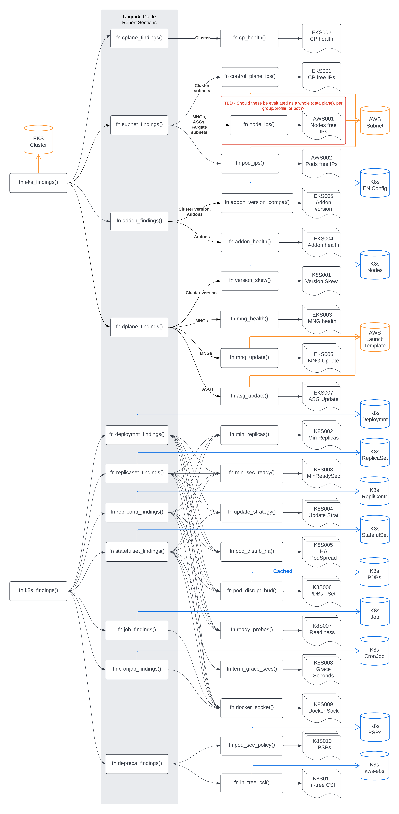

A check must be able to answer `yes` to one of the following questions, depending on the type of check:

- Required: It will adversely affect the cluster and/or the services/applications running on the cluster during an upgrade
- Recommended: It \*has the potential to affect the cluster and/or the services/applications running on the cluster during an upgrade

## Reference

### Analyze

Analyze cluster for any potential issues to remediate prior to upgrade.

Show result as plaintext via stdout:

```sh
eksup analyze --cluster <cluster> --region <region>
```

Show result as JSON via stdout:

```sh
eksup analyze --cluster <cluster> --region <region> --format json
```

Save result as plaintext to file:

```sh
eksup analyze --cluster <cluster> --region <region> --output analysis.txt
```

Save result as JSON to S3, ignoring recommendations:

```sh
eksup analyze \
  --cluster <cluster> \
  --region <region> \
  --format json \
  --output s3://<bucket>/<filename> \
  --ignore-recommended
```

### Create

Create a playbook with analysis findings to guide users through pre-upgrade, upgrade, and post-upgrade process.

Create playbook and save locally:

```sh
eksup create playbook --cluster <cluster> --region <region>
```

Create playbook and save locally, ignoring recommendations:

```sh
eksup create playbook --cluster <cluster> --region <region> --ignore-recommended
```

## 🚧 ToDo 🚧

- [ ] Add summary at top of results shown to user for stdout and playbook
  ```
  Checks: 31 (Failed: 14, Excluded: 0, Skipped: 0)
  ```
- [x] [`K8S001`] Version skew between control plane and data plane should adhere to skew policy

### Amazon EKS

- [x] [`EKS001`] There are at least 5 free IPs in control plane subnets
  - [ ] [`AWS001`] Report on number of free IPs in data plane subnets
    - TBD: should this be reported per MNG/ASG/profile, as a whole (data plane), or both?
  - [x] [`AWS002`] Report on number of free IPs used by the pods when using custom networking
- [x] [`EKS002`] Control plane is free of health issues
- [x] [`EKS003`] EKS managed node group(s) are free of health issues
- [x] [`EKS004`] EKS addon(s) are free of health issues
- [x] [`EKS005`] EKS addon version is within supported range; recommend upgrading if target Kubernetes version default addon version is newer
- [x] [`EKS006`] EKS managed node group(s): report if the launch template version is not the latest
- [x] [`EKS007`] Self-managed node group(s): report if the launch template version is not the latest
- [ ] Check AWS service limits and utilization for relevant resources
  - Requires premium support https://docs.aws.amazon.com/awssupport/latest/user/service-limits.html
  - [ ] [`AWS003`] EC2 instance service limits
    - `aws support describe-trusted-advisor-check-result --check-id 0Xc6LMYG8P`
  - [ ] EBS volume service limits
    - [ ] [`AWS004`] GP2 `aws support describe-trusted-advisor-check-result --check-id dH7RR0l6J9`
    - [ ] [`AWS005`] GP3 `aws support describe-trusted-advisor-check-result --check-id dH7RR0l6J3`

### Kubernetes Highly Available

|   Check    | Deployment | ReplicaSet | ReplicationController | StatefulSet | Job | CronJob |
| :--------: | :--------: | :--------: | :-------------------: | :---------: | :-: | :-----: |
| [`K8S001`] |     -      |     -      |           -           |      -      |  -  |    -    |
| [`K8S002`] |     ✅     |     ✅     |          ✅           |     ✅      | ❌  |   ❌    |
| [`K8S003`] |     ✅     |     ✅     |          ✅           |     ✅      | ❌  |   ❌    |
| [`K8S004`] |     ✅     |     ✅     |          ❌           |     ✅      | ❌  |   ❌    |
| [`K8S005`] |     ✅     |     ✅     |          ✅           |     ✅      | ❌  |   ❌    |
| [`K8S006`] |     ✅     |     ✅     |          ✅           |     ✅      | ❌  |   ❌    |
| [`K8S007`] |     ✅     |     ✅     |          ✅           |     ✅      | ❌  |   ❌    |
| [`K8S008`] |     ❌     |     ❌     |          ❌           |     ✅      | ❌  |   ❌    |
| [`K8S009`] |     ✅     |     ✅     |          ✅           |     ✅      | ✅  |   ✅    |
| [`K8S010`] |     -      |     -      |           -           |      -      |  -  |    -    |
| [`K8S011`] |     -      |     -      |           -           |      -      |  -  |    -    |

- [ ] [`K8S002`] `.spec.replicas` set >= 3
- [ ] [`K8S003`] `.spec.minReadySeconds` set > 0 - https://kubernetes.io/docs/concepts/workloads/pods/pod-lifecycle/#container-probes
- [ ] [`K8S004`] rolling update strategy is used
  - `.spec.strategy.type` != `Recreate` - https://kubernetes.io/docs/concepts/workloads/controllers/deployment/#rolling-update-deployment
    - (Deployment, ReplicaSet) - excludes ReplicationController which recommends blue/green upgrade
    - [ ] `.spec.strategy.rollingUpdate.maxUnavailable` is set (Recommended)
    - [ ] `.spec.strategy.rollingUpdate.maxSurge` is set (Recommended)
  - [ ] `.spec.updateStrategy.type` != `OnDelete` - https://kubernetes.io/docs/concepts/workloads/controllers/statefulset/#rolling-updates
    - (StatefulSet)
- [ ] [`K8S005`] `podDisruptionBudgets` set & at least one of `minAvailable` or `maxUnavailable` is set
- [ ] [`K8S006`] Either `.spec.affinity.podAntiAffinity` or `.spec.topologySpreadConstraints` set to avoid multiple pods from being scheduled on the same node. https://kubernetes.io/docs/concepts/configuration/assign-pod-node/
  - [ ] Prefer topology hints over affinity `Note: Inter-pod affinity and anti-affinity require substantial amount of processing which can slow down scheduling in large clusters significantly. We do not recommend using them in clusters larger than several hundred nodes.` https://kubernetes.io/docs/concepts/scheduling-eviction/assign-pod-node/#inter-pod-affinity-and-anti-affinity
- [ ] [`K8S007`] `.spec.containers[*].readinessProbe` set
  - [ ] `.spec.containers[*].livenessProbe` , if set, is NOT the same as `.spec.containers[*].readinessProbe`
  - [ ] `.spec.containers[*].startupProbe` is set if `.spec.containers[*].livenessProbe` is set
- [ ] [`K8S008`] `pod.Spec.TerminationGracePeriodSeconds` > 0 - The StatefulSet should not specify a pod.Spec.TerminationGracePeriodSeconds of 0 https://kubernetes.io/docs/concepts/workloads/controllers/statefulset/#deployment-and-scaling-guarantees
  - (StatefulSet)

#### Job/CronJob

- [ ] [`K8S---`] `.spec.suspend` set to `true` before upgrading, removed after upgrade (see questions - what is the best guidance for batch workloads?)

### Kubernetes Deprecations

Note: the Kubernetes version these apply to will need to be taken into consideration to avoid telling users about checks that do not apply to their version.

- [ ] [`K8S009`] Detect docker socket use (1.24+ affected) https://github.com/aws-containers/kubectl-detector-for-docker-socket
- [ ] [`K8S010`] Warn on pod security policy use (deprecated 1.21, removed 1.25) https://kubernetes.io/docs/concepts/security/pod-security-policy/
  - [ ] Advise to switch to pod security admission https://kubernetes.io/docs/concepts/security/pod-security-admission/
- [ ] [`K8S011`] In-tree to CSI migration https://kubernetes.io/blog/2021/12/10/storage-in-tree-to-csi-migration-status-update/ ?
  - [ ] The [in-tree Amazon EBS storage provisioner](https://kubernetes.io/docs/concepts/storage/volumes/#awselasticblockstore) is deprecated. If you are upgrading your cluster to version 1.23, then you must first install the Amazon EBS driver before updating your cluster. For more information, see [Amazon EBS CSI migration frequently asked questions](https://docs.aws.amazon.com/eks/latest/userguide/ebs-csi-migration-faq.html). If you have pods running on a version 1.22 or earlier cluster, then you must install the Amazon EBS driver before updating your cluster to version 1.23 to avoid service interruption. https://docs.aws.amazon.com/eks/latest/userguide/ebs-csi-migration-faq.html
  - Blog https://aws.amazon.com/blogs/containers/migrating-amazon-eks-clusters-from-gp2-to-gp3-ebs-volumes/

### Future Considerations

- [ ] APIs deprecated and/or removed in the next Kubernetes version
  - For now, `pluto` or `kubent` are recommended to check for deprecated APIs
  - Add section on how those tools work, what to watch out for (asking the API Server is not trustworthy, scanning manifests directly is the most accurate)
  - Look into using the `apiserve_requested_deprecated_apis` metric to detect usage of deprecated APIs
    - https://kubernetes.io/blog/2020/09/03/warnings/
    - https://github.com/kubernetes/enhancements/tree/master/keps/sig-api-machinery/1693-warnings
    - https://github.com/kube-rs/kube/issues/492 for implementation
- [ ] Add image and chart for running `eksup` on the cluster in a continuous fashion (CronJob)
  - Send results to a central location like S3 for centralized aggregation and reporting across a fleet of clusters
- [ ] Add support to output results in JSON and CSV formats
  - Multi-cluster scenario - all clusters emitting data back to central location to report on which clusters need components to be upgraded/modified
  - Can utilize an Athena table to aggregate and summarize data
- [ ] Configuration file to allow users more control over what checks they want to opt in/out of, the values of those checks, etc.
- [ ] Progress indicator https://github.com/console-rs/indicatif
- [ ] Ability to convert from one resource API version to another (where possible)
- [ ] Add snippets/information for commonly used provisioning tools to explain how those fit into the guidance
  - `terraform-aws-eks`/`eksctl` - how to upgrade a cluster with these tools, what will they do for the user (ensure addon versions are aligned with the Kubernetes version, the ordering of upgrade steps, etc.)
- [ ] Configure output levels
  1. `--quiet` - suppress all output
  2. (default, no flags) - show failed checks on hard requirements
  3. `--warn` - in addition to failed, show warnings (low number of IPs available for nodes/pods, addon version older than current default, etc.)
  4. `--info` - in addition to failed and warnings, show informational notices (number of IPs available for nodes/pods, addon version relative to current default and latest, etc.)

## High Level Diagram

<p align="center">
  
</p>

## Notes

- Prefer topology hints over affinity for larger clusters
  - [Inter-pod affinity and anti-affinity](https://kubernetes.io/docs/concepts/scheduling-eviction/assign-pod-node/#inter-pod-affinity-and-anti-affinity)
    > Note: Inter-pod affinity and anti-affinity require substantial amount of processing which can slow down scheduling in large clusters significantly. We do not recommend using them in clusters larger than several hundred nodes.

## Questions

- What is the guidance for batch workloads?
  - Recommend creating a maintenance window where workloads should avoid being scheduled?
  - `JobFailurePolicy` coming in in 1.26 https://kubernetes.io/docs/concepts/workloads/controllers/job/#pod-failure-policy
- What is the recommended way to manage the lifecycle of Fargate pods?
  - After the control plane Kubernetes version has been upgraded, what is the best approach to "roll" the pods in order to pull fresh pods/nodes with the new K8s version?
  - Use a mutating webhook to inject `nodeSelector: failure-domain.beta.kubernetes.io/zone: <AZ>` into pods created to distribute across the AZs. (EKS Fargate does not natively do this today - see https://github.com/aws/containers-roadmap/issues/824)
- What is the churn calculation for updating node groups?
  - What is the surge calculation - I thought I saw it was `2 * max(min-size, desired-size)` somewhere?
  - For EKS MNG, the surge limit is capped at 100 nodes - should this be applied to self-managed node groups as well, and if so, how?
  - This is important for:
    - Do users have enough resources at their disposal before the start their upgrade or do they need to request resource limit increases (EC2s)?
    - How does the number of available IPs affect this process? If a customer knows they only have `x` available IPs in the data plane (say 100), can we provide a calculation that helps them configure their update settings to avoid errors and exhausting IPs while upgrading?
    - How long will the upgrade take users?
    - How can users influence the amount of churn - why should they, what recommendations or guidance do we have?
- Do we have different guidance for large clusters?
  - See note on [Inter-pod affinity and anti-affinity](https://kubernetes.io/docs/concepts/scheduling-eviction/assign-pod-node/#inter-pod-affinity-and-anti-affinity)

## Kubernetes Future Features

Relevant features that are coming in future releases of Kubernetes. A feature is "relevant" in in this context if it is something that would be checked and reported on by `eksup` to aid in upgrades:

- `.spec.updateStrategy.rollingUpdate.maxUnavailable` for StatefulSets [`Kubernetes v1.24 [alpha]`](https://kubernetes.io/docs/concepts/workloads/controllers/statefulset/#maximum-unavailable-pods)
  - Recommend that a value is set on all StatefulSets
- `PodDisruptionCondition` for PodDisruptionBudgets [`Kubernetes v1.26 [beta]`](https://kubernetes.io/docs/concepts/workloads/pods/disruptions/#pod-disruption-conditions)
  - See recommendation below for `podFailurePolicy`
- `.spec.podFailurePolicy` for Jobs/CronJobs [`Kubernetes v1.26 [beta]`](https://kubernetes.io/docs/concepts/workloads/controllers/job/#pod-failure-policy)
  - Recommend to `Ignore` conditions caused by preemption, API-initiated eviction, or taint-based eviction so that upgrade type evictions do not count against `.spec.backoffLimit` and the jobs will be re-tried. Note - `.spec.restartPolicy` will need to be set to `Never` and `PodDisruptionCondition` must be set for PodDisruptionBudgets
